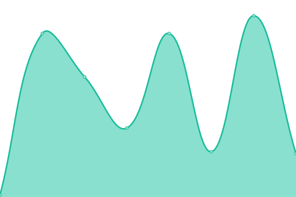

# [📈 Live Status](https://upptime.github.io/upptime): <!--live status--> **🟩 All systems operational**

This repository contains the open-source uptime monitor and status page for [Upptime](https://upptime.js.org), powered by [Upptime](https://github.com/upptime/upptime).

With [Upptime](https://upptime.js.org), you can get your own unlimited and free uptime monitor and status page, powered entirely by a GitHub repository. We use [Issues](https://github.com/upptime/upptime/issues) as incident reports, [Actions](https://github.com/Splashtop/Splashtop/actions) as uptime monitors, and [Pages](https://upptime.github.io/upptime) for the status page.

<!--start: status pages-->
<!-- This summary is generated by Upptime (https://github.com/upptime/upptime) -->
<!-- Do not edit this manually, your changes will be overwritten -->
<!-- prettier-ignore -->
| URL | Status | History | Response Time | Uptime |
| --- | ------ | ------- | ------------- | ------ |
|  [SSW Portal (US)](https://us.ssw.splashtop.com/) | 🟩 Up | [ssw-portal-us.yml](https://github.com/jundayou/ssw-status/commits/HEAD/history/ssw-portal-us.yml) | 

 250ms
     
 | 

<a href="https://status.ssw.splashtop.com/history/ssw-portal-us">100.00%</a>
    

|  Secret Manager (US) | 🟩 Up | [secret-manager-us.yml](https://github.com/jundayou/ssw-status/commits/HEAD/history/secret-manager-us.yml) | 

 46ms
     
 | 

<a href="https://status.ssw.splashtop.com/history/secret-manager-us">100.00%</a>
    

|  Controller (US) | 🟩 Up | [controller-us.yml](https://github.com/jundayou/ssw-status/commits/HEAD/history/controller-us.yml) | 

 45ms
     
 | 

<a href="https://status.ssw.splashtop.com/history/controller-us">100.00%</a>
    

|  Controller L4 (US) | 🟩 Up | [controller-l4-us.yml](https://github.com/jundayou/ssw-status/commits/HEAD/history/controller-l4-us.yml) | 

 46ms
     
 | 

<a href="https://status.ssw.splashtop.com/history/controller-l4-us">100.00%</a>
    

|  [Edge] Ashburn, VA, US | 🟩 Up | [edge-ashburn-va-us.yml](https://github.com/jundayou/ssw-status/commits/HEAD/history/edge-ashburn-va-us.yml) | 

 247ms
     
 | 

<a href="https://status.ssw.splashtop.com/history/edge-ashburn-va-us">100.00%</a>
    

|  [Edge] Portland, OR, US | 🟩 Up | [edge-portland-or-us.yml](https://github.com/jundayou/ssw-status/commits/HEAD/history/edge-portland-or-us.yml) | 

 240ms
     
 | 

<a href="https://status.ssw.splashtop.com/history/edge-portland-or-us">100.00%</a>
    

|  [Edge] Frankfurt, Germany | 🟩 Up | [edge-frankfurt-germany.yml](https://github.com/jundayou/ssw-status/commits/HEAD/history/edge-frankfurt-germany.yml) | 

 496ms
     
 | 

<a href="https://status.ssw.splashtop.com/history/edge-frankfurt-germany">100.00%</a>
    

|  [Edge] Taipei, TW | 🟩 Up | [edge-taipei-tw.yml](https://github.com/jundayou/ssw-status/commits/HEAD/history/edge-taipei-tw.yml) | 

 580ms
     
 | 

<a href="https://status.ssw.splashtop.com/history/edge-taipei-tw">100.00%</a>
    

|  [Edge] HongKong, China | 🟩 Up | [edge-hong-kong-china.yml](https://github.com/jundayou/ssw-status/commits/HEAD/history/edge-hong-kong-china.yml) | 

 672ms
     
 | 

<a href="https://status.ssw.splashtop.com/history/edge-hong-kong-china">100.00%</a>
    

|  [Edge] London, England | 🟩 Up | [edge-london-england.yml](https://github.com/jundayou/ssw-status/commits/HEAD/history/edge-london-england.yml) | 

 445ms
     
 | 

<a href="https://status.ssw.splashtop.com/history/edge-london-england">100.00%</a>
    

|  [Edge] Tokyo, Japan | 🟩 Up | [edge-tokyo-japan.yml](https://github.com/jundayou/ssw-status/commits/HEAD/history/edge-tokyo-japan.yml) | 

 499ms
     
 | 

<a href="https://status.ssw.splashtop.com/history/edge-tokyo-japan">100.00%</a>
    

<!--end: status pages-->

[**Visit our status website →**](https://upptime.github.io/upptime)

## 📄 License

- Powered by: [Upptime](https://github.com/upptime/upptime)
- Code: [MIT](./LICENSE) © [Anand Chowdhary](https://anandchowdhary.com), supported by [Pabio](https://pabio.com)
- Data in the `./history` directory: [Open Database License](https://opendatacommons.org/licenses/odbl/1-0/)
